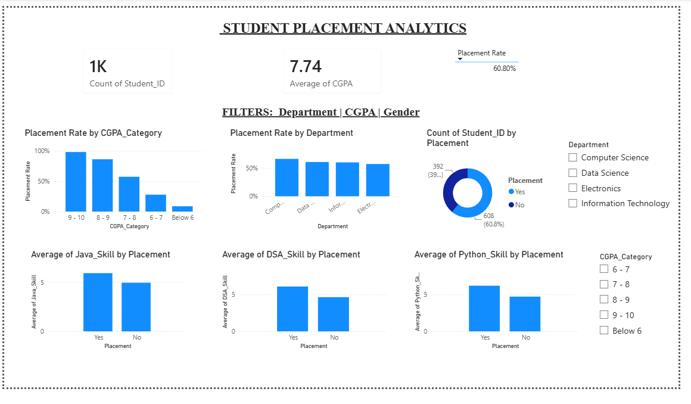
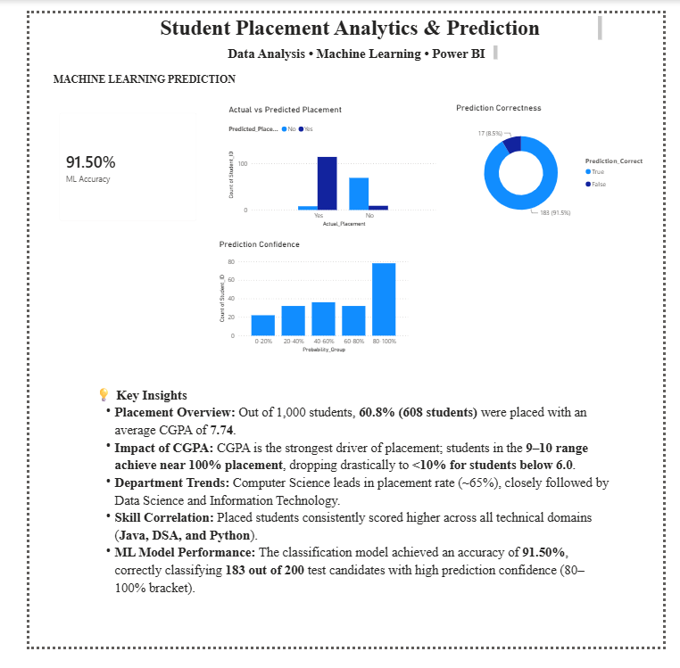

# 🎓 Student Placement Analytics & Machine Learning Prediction

An end-to-end data analytics and machine learning project designed to analyze student academic and technical skills, uncover campus placement patterns, and predict placement outcomes.

---

## 📌 Project Overview
This project combines **Exploratory Data Analysis (EDA)**, **Supervised Machine Learning**, and **Power BI Interactive Dashboards** to deliver actionable insights into student employability.

* **Dataset Size:** 1,000 Student Records
* **Overall Placement Rate:** 60.80%
* **ML Model Accuracy:** 91.50% (Tested on 200 hold-out samples)

---

## 🛠️ Tech Stack & Tools
* **Programming & ML:** Python (`pandas`, `numpy`, `scikit-learn`)
* **Business Intelligence:** Power BI (DAX, Interactive Dashboards, Data Modeling)
* **IDE / Editor:** Visual Studio Code (VS Code)

---

## 📊 Dashboard Preview

### Page 1: Student Placement Analytics


### Page 2: Machine Learning Prediction


---

## 🧠 Key Findings & Insights
1. **Academic Performance Matters Most:** A direct correlation exists between CGPA and placement success. Students scoring >8.0 CGPA have over an 80% placement rate.
2. **Technical Mastery:** Placed students consistently exhibit higher average skill ratings in Data Structures & Algorithms (DSA), Java, and Python.
3. **High ML Reliability:** The trained model reliably isolates borderline profiles and achieves 91.50% predictive accuracy with high prediction confidence.

---

## 🚀 How to Run the Project

1. **Clone the repository:**
   ```bash
   git clone [https://github.com/VIKASHINIDEVARAj/DATA_ANALYST.git]
   cd DATA_ANALYST
   python src/train_model.py   
